<p align="center">
  
</p>

# PEHCHAAN — AI-Based Fake Identity & Document Screening

**Smart India Hackathon 2026 · Problem Statement 26188** · Ministry of Home Affairs ·
Sashastra Seema Bal (SSB) · Theme: **Blockchain & Cybersecurity**

PEHCHAAN screens identity documents at a border checkpoint. An officer uploads or
photographs a passport, Aadhaar, PAN card or driving licence, optionally with a live photo
of the traveller. Within seconds the system returns a 0–100 risk score, a verdict
(CLEAR / REVIEW / HIGH RISK) and the evidence behind every point of that score. Each
screening becomes a tamper-evident record: hash-chained, signed, sealed into a Merkle
batch and anchored on a Hyperledger Fabric ledger.

| | |
|---|---|
| Live dashboard | https://tumharipehchaan.vercel.app |
| Android app | [Latest release (APK)](https://github.com/ScholarlyAdeeb/Pehchaan/releases/latest) |
| Architecture and measured results | [docs/TECHNICAL_ARCHITECTURE.md](docs/TECHNICAL_ARCHITECTURE.md) |
| API | [docs/API.md](docs/API.md) |
| Deployment | [docs/DEPLOYMENT_VERCEL.md](docs/DEPLOYMENT_VERCEL.md) |
| Problem statement | [docs/PROBLEM_STATEMENT.md](docs/PROBLEM_STATEMENT.md) |

## Demo sign-in

Open https://tumharipehchaan.vercel.app (or the Android app) and sign in with one of these
accounts. Each role sees a different workspace.

| Role | Official ID / Email | Password | What you can do |
|---|---|---|---|
| Officer | `officer@pehchaan.gov.in` | `officer123` | Screen documents, see your own screenings and reports |
| Post In-Charge | `incharge@pehchaan.gov.in` | `incharge123` | Supervise assigned checkpoints, review officers' activity, co-sign overrides |
| Administrator | `admin@pehchaan.gov.in` | `ABC@12345678` | Everything: analytics, audit trail, system logs, security and trust, users and checkpoints |

These are shared demonstration accounts on demonstration data. Please do not change their
passwords or deactivate users, so the next person can sign in too.

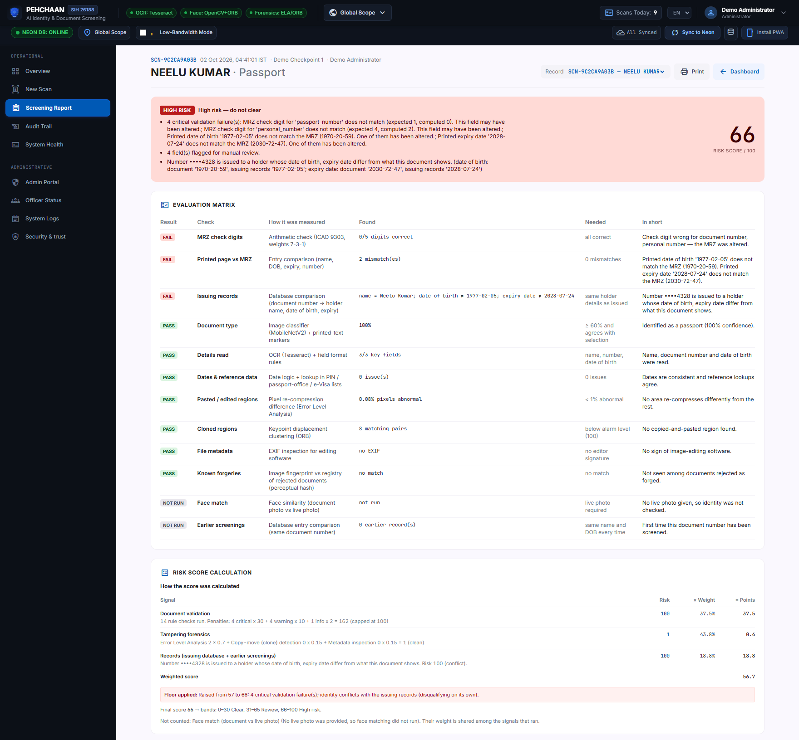

> **About the screenshots.** They were taken from a local demo instance with a throwaway
> database. Every person, document and account shown is invented (the documents come from
> the project's generated dataset), and portraits are blurred.

---

## Contents

1. [What a screening does](#what-a-screening-does)
2. [Cybersecurity](#cybersecurity)
3. [Blockchain and tamper evidence](#blockchain-and-tamper-evidence)
4. [Screens](#screens)
5. [Architecture](#architecture)
6. [How the risk score is calculated](#how-the-risk-score-is-calculated)
7. [Models and measured results](#models-and-measured-results)
8. [Run it](#run-it)
9. [Repository layout](#repository-layout)
10. [What is not built](#what-is-not-built)

---

## What a screening does

| Step | What happens | How |
|---|---|---|
| 1. Identify the document | Aadhaar, PAN, driving licence or passport; visa and permit by printed text | MobileNetV2 classifier + printed-text markers |
| 2. Read the fields | Name, dates, document number, address, MRZ | Tesseract 5 OCR on the full page, plus a Faster R-CNN field detector that reads each located box on its own |
| 3. Validate | ICAO 9303 check digits, printed page vs MRZ, Aadhaar Verhoeff checksum, PAN and licence formats, expiry, PIN code vs state | Deterministic rules, each with a severity |
| 4. Look for tampering | Edited or pasted regions, cloned regions, editing-software traces | Error Level Analysis, ORB copy-move detection, EXIF inspection |
| 5. Match the face | Document portrait vs live photo | OpenCV YuNet detector + SFace embeddings |
| 6. Check the records | Was this number issued to this holder? Was it screened before under another name? Is it a known forgery? | Issued-documents database, earlier screenings, perceptual-hash forgery registry |
| 7. Score and explain | One score, one verdict, one line of evidence per check | Weighted risk engine with hard floors |
| 8. Seal the record | The result cannot be altered unnoticed afterwards | Hash chain, signed audit entry, Merkle batch, Fabric anchor |

All models run on the checkpoint machine. No external API is called during a scan, and the
system advises: the officer makes the decision.

---

## Cybersecurity

The system handles identity documents and produces decisions that can be challenged
later, so the security design covers four things: who can act, how services talk to each
other, what personal data is kept, and how misuse by an insider is noticed.

### Controls in the code

| Area | Control | Where |
|---|---|---|
| **Passwords** | bcrypt, cost 12. New accounts get a random one-time password that must be changed at first sign-in. Published default passwords are refused. | `Pehchaan/server/security.ts` |
| **First-time setup** | The first admin can be created only with a one-time code printed in the server console. | `Pehchaan/server/security.ts` |
| **Sessions** | 15-minute access token and 12-hour refresh token in `HttpOnly`, `SameSite=Strict` cookies (`Secure` over HTTPS). Nothing is kept in `localStorage`. | `Pehchaan/server/session.ts` |
| **Refresh-token rotation** | Every refresh issues a new token and retires the old one. Presenting an already used token (a stolen copy) revokes every session from that sign-in. | `Pehchaan/server/session.ts` |
| **CSRF** | State-changing requests must echo a CSRF value in `X-CSRF-Token` (double-submit check). | `Pehchaan/server/session.ts`, `src/services/apiFetch.ts` |
| **Brute force** | Sign-in attempts are rate limited per address; blocked attempts are logged. | `Pehchaan/server.ts` |
| **Roles and scope** | `OFFICER`, `POST_INCHARGE`, `ADMIN`. Role and checkpoint are checked in the gateway on every route; the browser's claims are never trusted. | `Pehchaan/server.ts` |
| **Two-person rule** | Clearing a traveller the system flagged needs a written reason and a Post In-Charge co-signature. | `Pehchaan/server/trust.ts` |
| **Gateway to engine** | Mutual TLS with a private certificate authority, plus a shared API key. Plain HTTP is served on loopback only. | `backend/run_engine.py`, `Pehchaan/server/engine-transport.ts` |
| **Browser hardening** | Content Security Policy, `X-Frame-Options: DENY`, `nosniff`, strict referrer policy, camera limited to the app's own origin. | `Pehchaan/server.ts` |
| **Personal data** | Document numbers are stored only as a keyed hash plus a masked form (`••••4328`). Raw text and images are removed from scans older than the retention period (default 90 days). | `backend/app/modules/records/pii.py`, `Pehchaan/server/neon.ts` |
| **Model integrity** | Model files load only if their SHA-256 matches the manifest; PyTorch checkpoints load with `weights_only=True`. | `backend/app/modules/provenance.py` |
| **Secrets** | Generated on first start into git-ignored `.env` files; the gateway refuses to start without them. | `Pehchaan/server/bootstrap-secrets.ts` |
| **Offline sign-in** | A sealed (HMAC) local copy of the account lets an officer sign in when the database is unreachable, for 7 days after the last online sign-in. An edited file is rejected whole. | `Pehchaan/server/offline-auth.ts` |

### Verified, not only claimed

| Check | Result |
|---|---|
| Engine without a client certificate, without trusting the authority, or over plain HTTP | Refused |
| Valid client certificate but no API key | 401 |
| Edited offline sign-in cache (role raised to ADMIN) | Whole cache rejected |
| Reused refresh token | All sessions from that sign-in revoked |
| Second write of an anchored batch to the ledger | Rejected by the chaincode |

Commands are in [Tests](#tests).

### Insider-threat alerts

Officers are the most privileged users, so the system watches its own users. The admin
Security screen raises alerts on patterns such as frequent requests to clear flagged
travellers, overrides refused by the In-Charge, a large share of screenings between 22:00
and 05:00, the same document screened three or more times, and repeated failed sign-ins.

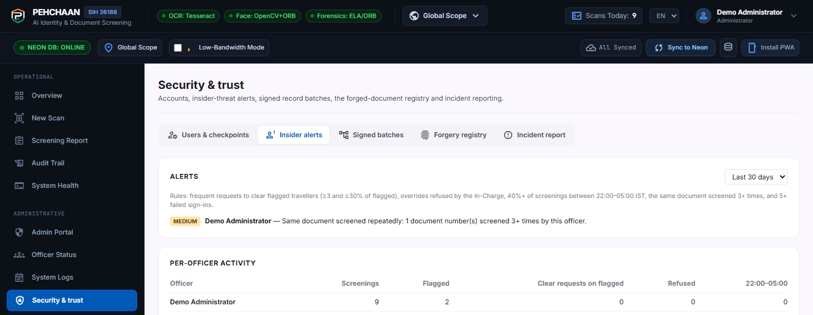

### Forged-document registry

When an officer rejects a document as forged, only its image fingerprint (perceptual
hashes of the page and the photo region) and the failed checks are stored: no names,
numbers or photos. Every later scan is compared with the registry, so the same forged
document presented at another checkpoint is flagged immediately. Entries are hash-chained.

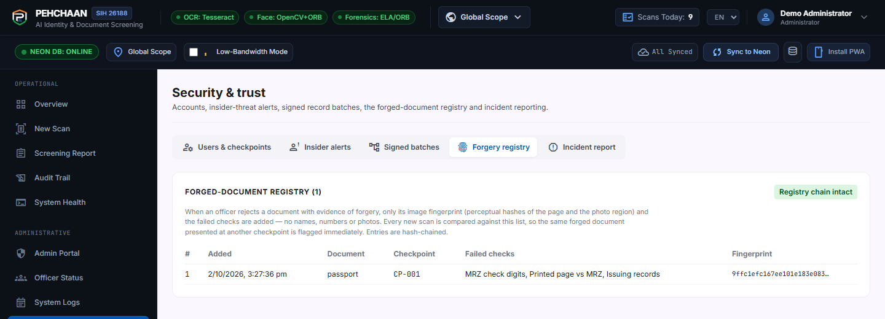

### Accounts, checkpoints and incident reporting

Admins create accounts with one-time passwords, assign checkpoints, and can produce a
CERT-In style incident report: system events, signed audit entries, officer decisions,
registry additions, hash-chain integrity and insider alerts for a chosen window, in one
file with its SHA-256.

| Accounts and checkpoints | Incident report |
|---|---|
| 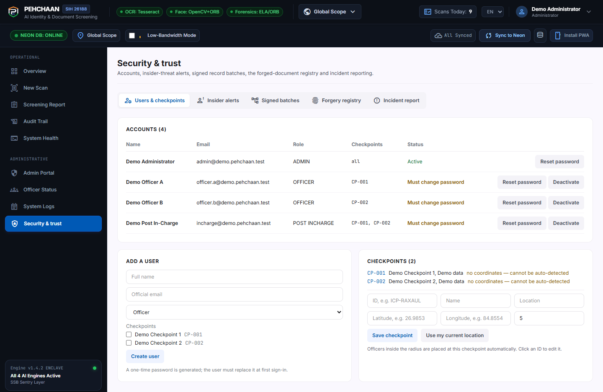 | 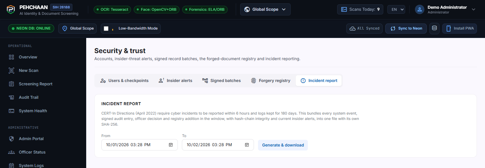 |

Every sign-in, screening, sealing and configuration change is also written to a system
log that only admins can read:

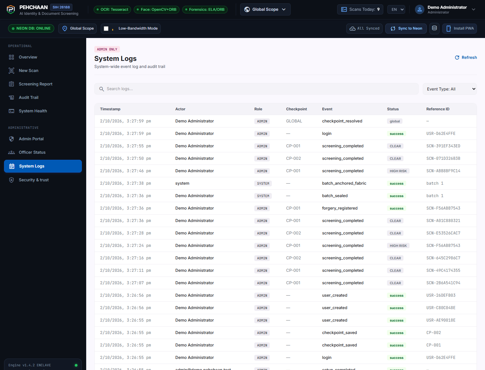

---

## Blockchain and tamper evidence

A screening record may be needed months later in an investigation or a court. PEHCHAAN
therefore makes every record tamper-evident in four layers, each protecting against a
different kind of change.

| Layer | What it is | What it protects against |
|---|---|---|
| **1. Hash chain** | Each scan row stores `SHA-256(previous row hash + this record)`. | Editing or deleting a record: every later link breaks. |
| **2. Signed audit entries** | Every screening and officer decision is an audit entry signed with HMAC-SHA256; signatures are re-checked each time a report loads. | Rewriting what was found or decided. |
| **3. Merkle batches** | Every 10 minutes new records are sealed into a Merkle tree whose root is signed with the server's Ed25519 key. Each record gets a receipt (its hash plus sibling hashes). | Rewriting history wholesale; lets one record be proven without revealing any other. |
| **4. Hyperledger Fabric** | Each batch root is written to the `auditledger` chaincode on a Fabric 2.5 channel. The chaincode accepts a batch id once. | A database administrator rewriting both the records and the batch table: the ledger copy is outside their control. |

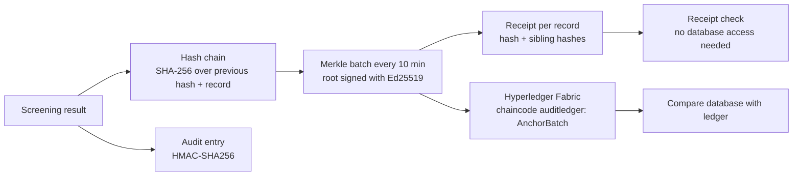
```mermaid
flowchart LR
    S[Screening result] --> H["Hash chain<br/>SHA-256 over previous hash + record"]
    S --> A["Audit entry<br/>HMAC-SHA256"]
    H --> M["Merkle batch every 10 min<br/>root signed with Ed25519"]
    M --> R["Receipt per record<br/>hash + sibling hashes"]
    M --> F["Hyperledger Fabric<br/>chaincode auditledger: AnchorBatch"]
    F --> V["Compare database with ledger"]
    R --> P["Receipt check<br/>no database access needed"]
```

### On the ledger

- `AnchorBatch` stores the Merkle root, record count, first and last record ids and the
  gateway's signature. A second write for the same batch, with any content, is rejected.
- **No personal data goes on chain**: only roots and counts.
- The gateway waits until the transaction is committed in a block and stores the
  transaction id with the batch. Batches sealed while the peer was unreachable are
  anchored by the next maintenance run.
- "Compare database with ledger" checks every batch root in PostgreSQL against Fabric.
  A difference means the database was rewritten after sealing.
- Chaincode: [`fabric/chaincode/auditledger/auditledger.go`](fabric/chaincode/auditledger/auditledger.go)
  (`AnchorBatch`, `GetBatch`, `VerifyRoot`, `ListBatches`). Client:
  [`Pehchaan/server/fabric.ts`](Pehchaan/server/fabric.ts), using the official
  `@hyperledger/fabric-gateway` library.

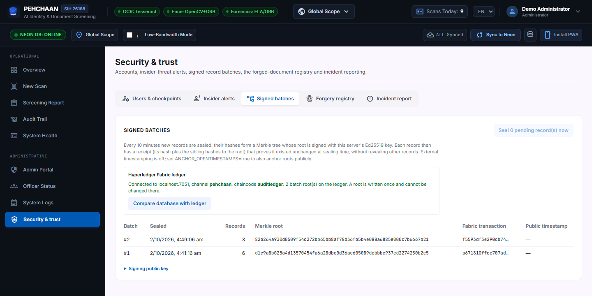

### In the report

Each report shows the record's block number and chained hash, the officer's decision, a
receipt that can be verified or downloaded, and the signed audit trail for that record.

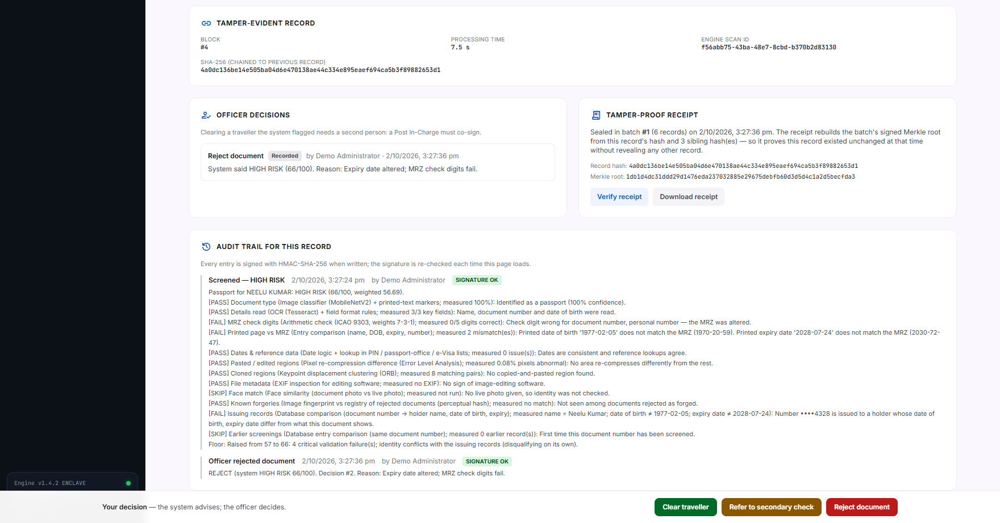

The audit trail screen recomputes every hash on demand:

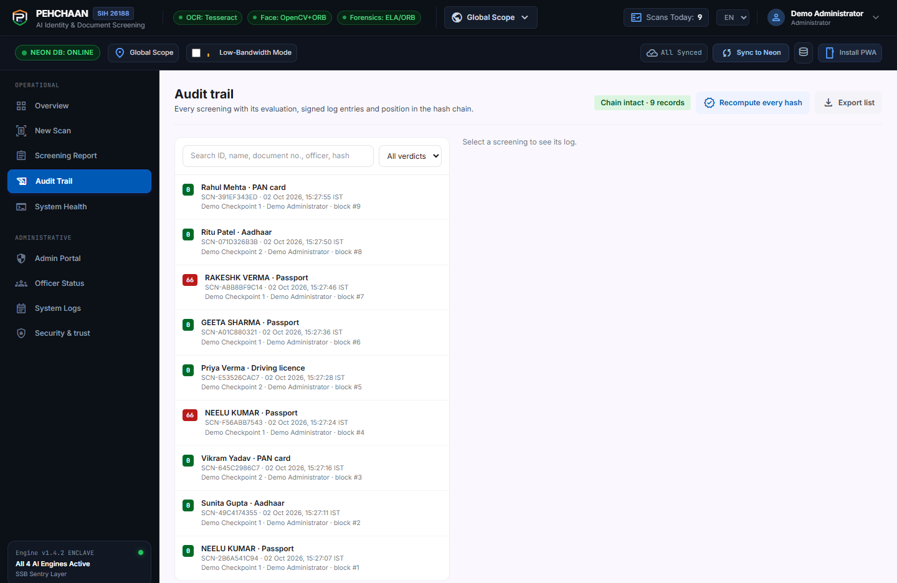

### The network, stated plainly

`bash fabric/network.sh up` creates the network with Docker: identities, a Raft orderer,
one peer for the organisation `SSBMSP`, the channel `pehchaan` and the chaincode, with TLS
on every link. A root is committed in about 2 seconds on the development machine.

It is a real Fabric ledger, and the database administrator does not hold its keys. It has
**one organisation and one orderer**, so today a single party endorses and orders every
transaction. The full value of a permissioned blockchain comes when several organisations
each run a peer (for example the border force and the immigration authority). Adding one
is a configuration change in `fabric/network/`, not a code change, and it has not been
done.

---

## Screens

The sign-in page opens with a short entrance: the shield, the name, a pass over the
supported document types, then the form. It is motion only, never blocks typing, and is
skipped when the device asks for reduced motion.

| Sign in | Overview |
|---|---|
| 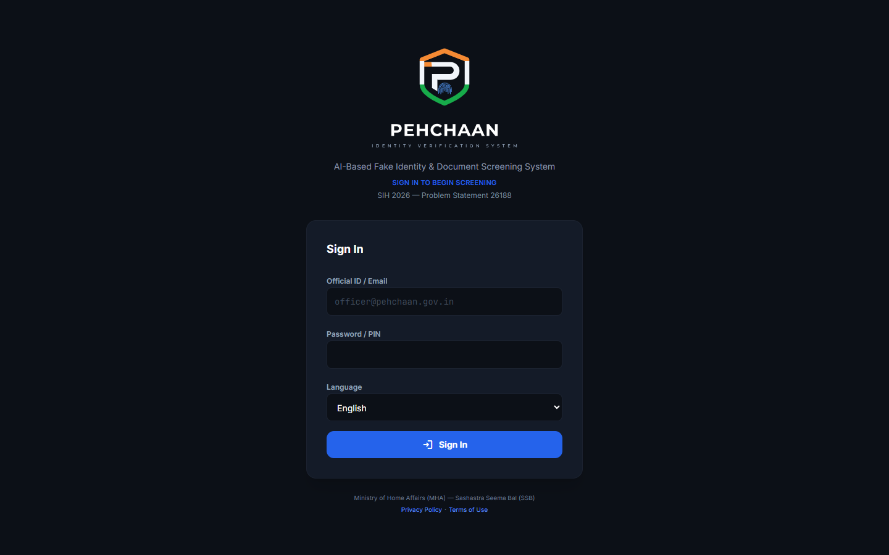 | 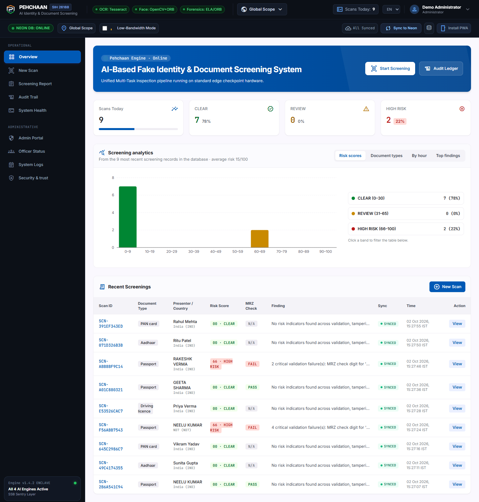 |

| New screening | A document that passes |
|---|---|
| 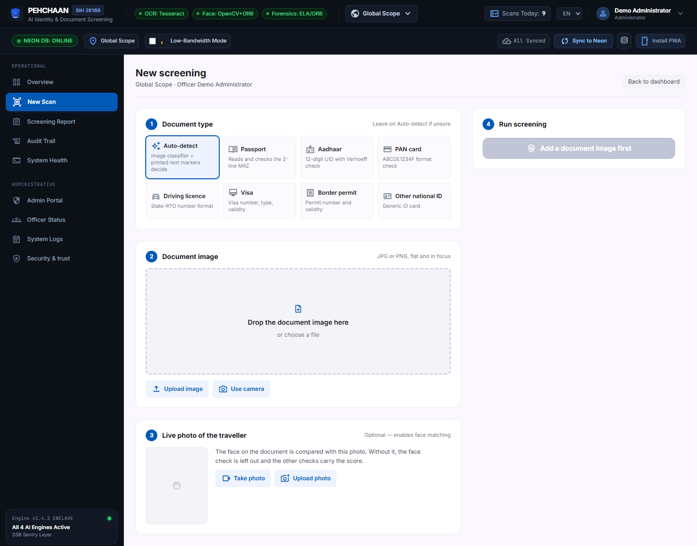 | 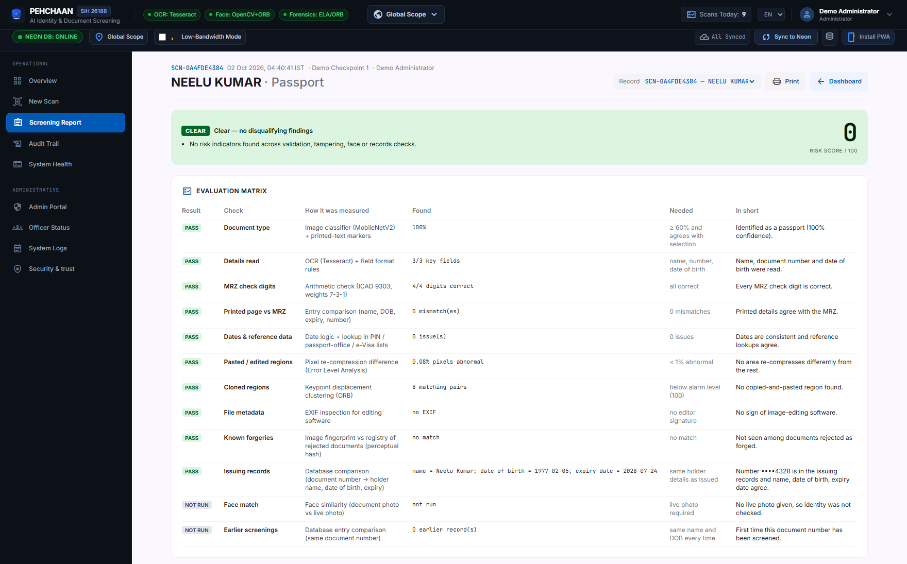 |

**Evidence in a report**: detected type, every extracted field and where it came from, the
MRZ with each check digit recomputed, and all rule results.

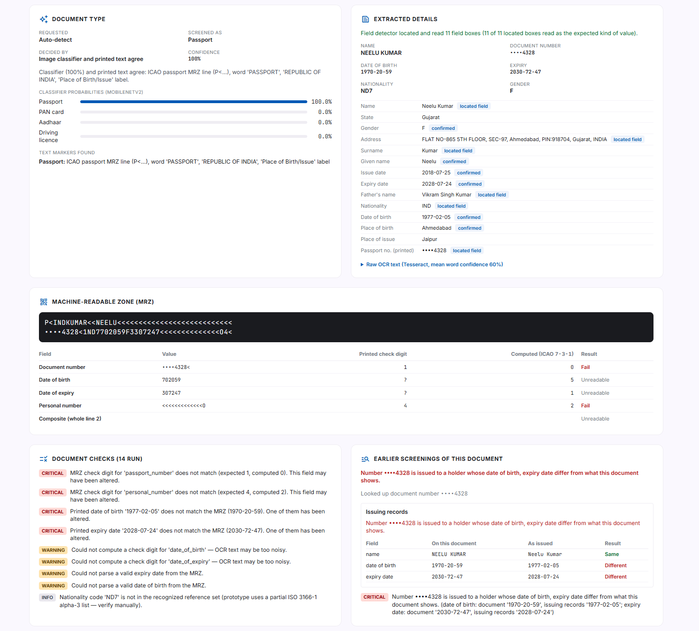

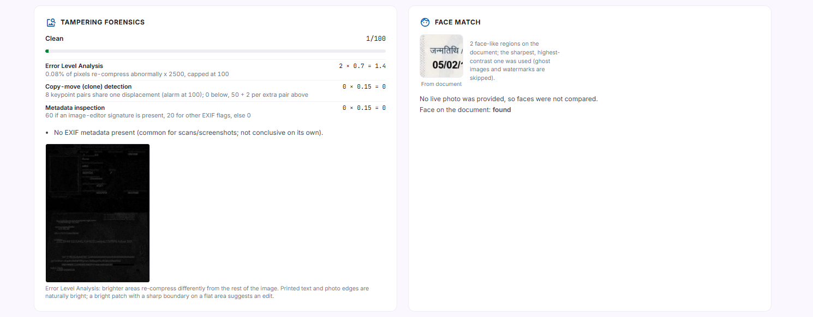

| System health and models | Admin portal |
|---|---|
| 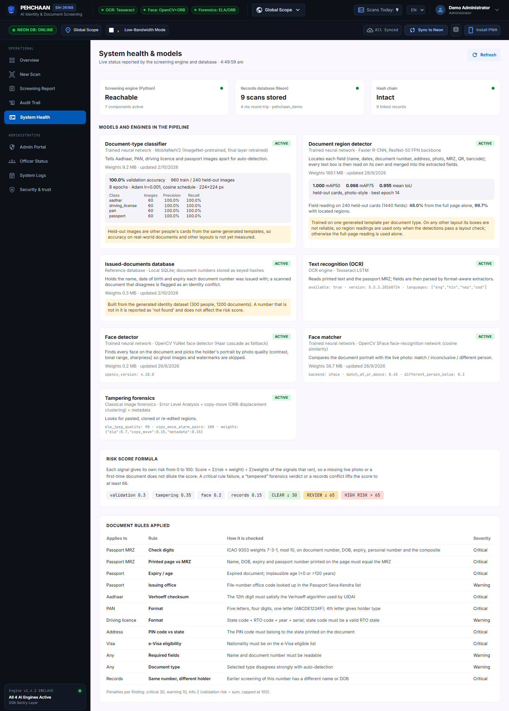 | 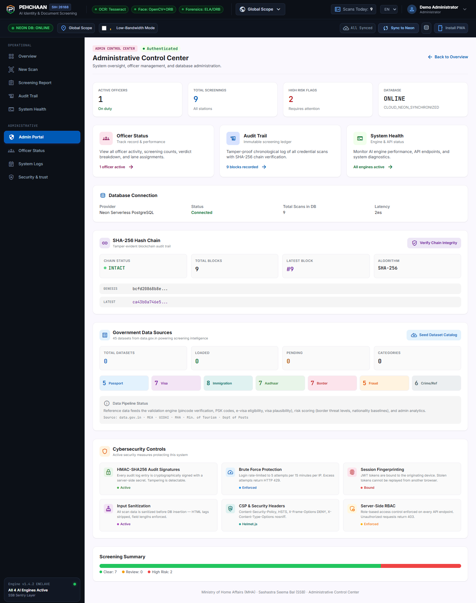 |

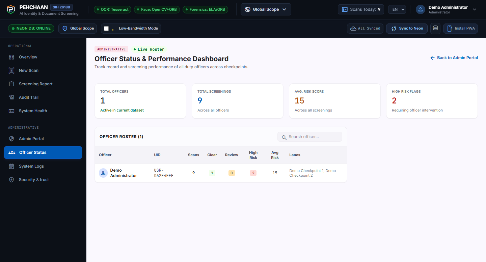

One sign-in, three workspaces: officers see screening and their own records; a Post
In-Charge supervises assigned checkpoints and co-signs overrides; admins see analytics,
logs, security and configuration. The interface is available in English, Hindi and Nepali
(navigation, sign-in and overview; working screens are English).

---

## Architecture

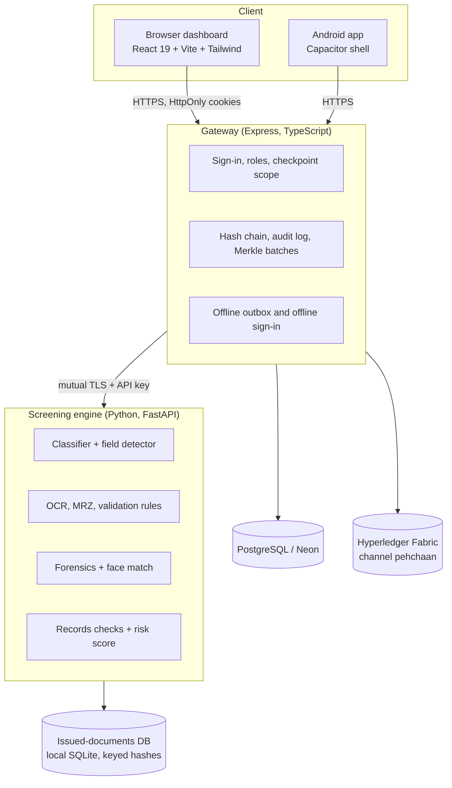
```mermaid
flowchart TB
    subgraph Client
      B[Browser dashboard<br/>React 19 + Vite + Tailwind]
      A[Android app<br/>Capacitor shell]
    end
    subgraph Gateway["Gateway (Express, TypeScript)"]
      G1[Sign-in, roles, checkpoint scope]
      G2[Hash chain, audit log, Merkle batches]
      G3[Offline outbox and offline sign-in]
    end
    subgraph Engine["Screening engine (Python, FastAPI)"]
      E1[Classifier + field detector]
      E2[OCR, MRZ, validation rules]
      E3[Forensics + face match]
      E4[Records checks + risk score]
    end
    B -- HTTPS, HttpOnly cookies --> Gateway
    A -- HTTPS --> Gateway
    Gateway -- mutual TLS + API key --> Engine
    Gateway --> DB[(PostgreSQL / Neon)]
    Gateway --> FAB[(Hyperledger Fabric<br/>channel pehchaan)]
    Engine --> IDB[(Issued-documents DB<br/>local SQLite, keyed hashes)]
```

| Part | Stack | Runs on |
|---|---|---|
| Dashboard | React 19, TypeScript, Vite 6, Tailwind 4, Recharts | Vercel (static) or the checkpoint machine |
| Gateway | Express, `pg`, `jsonwebtoken`, `bcryptjs`, `helmet`, `@hyperledger/fabric-gateway` | Vercel (one serverless function) or the checkpoint machine |
| Screening engine | Python 3.11, FastAPI, PyTorch, OpenCV, Tesseract 5 | Checkpoint machine or a VM (too large for Vercel) |
| Database | PostgreSQL (Neon) | Hosted |
| Ledger | Hyperledger Fabric 2.5, Go chaincode | Docker on the checkpoint machine or a VM |
| Android app | Capacitor 8 | Phone; loads the hosted dashboard |

**Offline operation.** The engine and gateway run on the checkpoint machine, so screening
itself needs no network. If the cloud database is unreachable, the scan, its signed audit
entry and its log are queued on disk and replayed in order when the connection returns.
This applies to a checkpoint installation, not to the Vercel deployment, which has no
disk to queue on.

---

## How the risk score is calculated

Every signal produces its own risk from 0 (nothing wrong) to 100:

| Signal | Risk | Weight |
|---|---|---|
| Document validation | Sum of rule penalties (critical 30, warning 10, info 2), capped at 100 | 0.30 |
| Tampering forensics | ELA × 0.7 + copy-move × 0.15 + metadata × 0.15 | 0.35 |
| Face match | Different person 100 · inconclusive 60 · same person (1 − similarity) × 20 | 0.20 |
| Records | Identity conflict 100 · previously flagged 50 · consistent 0 | 0.15 |

```
score = Σ (risk × weight) / Σ (weights of the signals that actually ran)
```

A signal that did not run (no live photo, number unknown to the records) is left out and
the remaining weights are rescaled, so missing evidence never lowers a score.

**Floors applied after weighting**

| Condition | Minimum score |
|---|---|
| Any critical validation failure, a "tampered" forensics verdict, or a records conflict | 66 |
| Face is clearly a different person | 85 (90 when far below the threshold) |
| Face inconclusive | 45 |

**Bands:** 0–30 CLEAR · 31–65 REVIEW · 66–100 HIGH RISK.

**Worked example** (the tampered passport in the first screenshot, no live photo):

| Signal | Risk | Effective weight | Points |
|---|---|---|---|
| Validation: 4 critical × 30 + 4 warnings × 10 + 1 info × 2 = 162, capped | 100 | 37.5% | 37.5 |
| Tampering: clean | 1 | 43.8% | 0.4 |
| Records: number issued to a holder with different dates | 100 | 18.8% | 18.8 |
| **Weighted** | | | **56.7 → floor → 66 HIGH RISK** |

Every report shows this table, and the same lines are written into the signed audit entry.

---

## Models and measured results

| Component | What it is | Measured |
|---|---|---|
| Document-type classifier | MobileNetV2, 4 classes (Aadhaar, driving licence, PAN, passport) | 100% on 240 held-out cards, also on photo-style versions |
| Field detector | Faster R-CNN, ResNet-50 FPN, 15 field classes | mAP@0.5 1.000 · mAP@0.75 0.998 · mean IoU 0.955; about 110 ms on GPU, 2 s on CPU |
| Field reading | Tesseract full page vs full page + located fields | 48.0% → **99.65%** of 1,440 fields on the held-out cards |
| OCR | Tesseract 5 LSTM (English, Hindi, Nepali) | — |
| Face detector / matcher | OpenCV YuNet / SFace (cosine similarity; match ≥ 0.45, different < 0.30) | — |
| Tampering | ELA, ORB copy-move, EXIF | — |
| Issued-documents database | 1,200 generated documents for 300 invented people; numbers stored as keyed hashes | — |

Field reading by document type:

| Document | Full page only | With located fields |
|---|---|---|
| Aadhaar | 91.3% | 100% |
| PAN | 0% | 100% |
| Driving licence | 17.8% | 99.7% |
| Passport | 68.0% | 99.3% |

**What these numbers mean.** Both models were trained and measured on generated cards,
with 60 of the 300 people held out. Every card of a type comes from one template, so the
scores show the models handle unseen people, values and photo-style distortion on these
layouts. They are **not** a measurement on real documents. On an unfamiliar layout the
detector's boxes are not used: a layout check falls back to the full-page reading and the
report says so.

Admins see all of this live on **System health & models**.

---

## Run it

Requirements: Python 3.11, Node 20+, the **Tesseract OCR** binary, and the two OpenCV face
models in `backend/models/face/` (`face_recognition_sface_2021dec.onnx`,
`face_detection_yunet_2023mar.onnx`, from the OpenCV model zoo).

```bat
start_all.bat
```

This creates the Python environment, installs dependencies, generates secrets, issues the
TLS certificates for the gateway-engine link, builds the issued-documents database if the
generated dataset is present, and opens two windows:

| Service | URL |
|---|---|
| Dashboard + gateway | http://localhost:3000 |
| Screening engine | https://127.0.0.1:8000 (mutual TLS: only the gateway can call it) |

Manual start:

```bash
# engine
cd backend
python -m venv .venv && .venv\Scripts\activate
pip install -r requirements.txt
python -m scripts.make_tls_certs      # once
python run_engine.py

# dashboard and gateway
cd Pehchaan
npm install
npm run dev
```

Configuration: copy `backend/.env.example` → `backend/.env` and `Pehchaan/.env.example` →
`Pehchaan/.env`, and put the same PostgreSQL connection string in both.

**First sign-in.** On an empty database the server console prints a one-time setup code.
Choose *First-time setup* on the sign-in page and enter it to create the admin account.

**Fabric ledger** (optional, needs Docker): `bash fabric/network.sh up`.

**Demo documents:** `cd backend && .venv\Scripts\python scripts\make_demo_samples.py` writes
a genuine, a tampered and a cloned passport to `sample-data/`.

### Deploy

The dashboard and gateway deploy to Vercel from the `Pehchaan` directory
(`Pehchaan/vercel.json`). The engine and the Fabric network run on a machine you control;
the gateway reaches the engine over mutual TLS. Steps and environment variables:
[docs/DEPLOYMENT_VERCEL.md](docs/DEPLOYMENT_VERCEL.md).

### Android app

[`mobile/`](mobile) is a thin Capacitor shell that opens the hosted dashboard full-screen,
so it signs in with the same secure cookies as a browser and always shows the deployed
version. Download the APK from the
[releases page](https://github.com/ScholarlyAdeeb/Pehchaan/releases/latest); build notes
are in [mobile/README.md](mobile/README.md).

### Tests

| Check | Command | Result |
|---|---|---|
| Engine | `cd backend && python -m pytest -q` | 111 pass |
| Gateway | `cd Pehchaan && npm run lint && npm test` | Type check; 7 queue checks, offline path check, 12 session and offline sign-in checks |
| Engine link | `cd Pehchaan && npx tsx server/tls.check.ts` (engine running) | Mutual TLS verified |
| Fabric | `bash fabric/network.sh up`, then `cd Pehchaan && npx tsx server/fabric.check.ts` | Anchor committed; rewrite rejected |
| Field reading | `cd backend && python training/eval_region_ocr.py` | Table above |

---

## Repository layout

```
Pehchaan/                    dashboard and gateway
  src/                       React app (components, contexts, services)
  server.ts                  Express routes: sign-in, roles, screenings, security
  server/                    session.ts, security.ts, trust.ts (batches, receipts, decisions),
                             fabric.ts, hashchain.ts, outbox.ts, offline-auth.ts, neon.ts, …
  api/index.js, vercel.json  Vercel function entry and configuration
backend/                     screening engine
  app/api/                   scan, face, health and reference routes
  app/modules/               classification, localization, ocr, validation, tampering,
                             face, records, risk, security
  training/                  train.py, train_region_detector.py, metrics
  scripts/                   cardgen/ (dataset generator), make_tls_certs.py, …
  run_engine.py              starts the engine (mutual TLS when certificates exist)
  tests/
fabric/                      Hyperledger Fabric
  network.sh                 up | deploy | status | down | destroy
  network/                   crypto-config, configtx, docker-compose
  chaincode/auditledger/     Go chaincode that stores batch roots
mobile/                      Android app (Capacitor)
docs/                        architecture, API, deployment, slides, screenshots
sample-data/                 demo images (generated locally, not committed)
start_all.bat                one-step local launcher (Windows)
```

Model weights, the generated dataset, certificates, databases and `.env` files are not in
the repository; they are produced by the scripts above.

---

## What is not built

| Area | Actual state |
|---|---|
| Multi-organisation blockchain | The Fabric ledger is real but has one organisation and one orderer. |
| Accuracy on real documents | Not measured. All figures are on generated cards from one template per document type. |
| Watchlist, Interpol or immigration lookups | Not built. Records checks cover the issued-documents database and earlier PEHCHAAN screenings. |
| Offline use of the hosted deployment | The offline queue and offline sign-in work on a checkpoint installation, not on Vercel. |
| Offline administration and earlier-screenings lookup | Need the database. |
| Hindi and Nepali throughout | Navigation, sign-in and overview only. |
| External timestamping | Code paths exist for an RFC 3161 authority and OpenTimestamps; neither is configured. |
| Android app | A shell around the hosted dashboard; it has not yet been tested on a physical phone. |
| Copy-move detection | Deliberately conservative: it catches large clones and misses small ones. |
